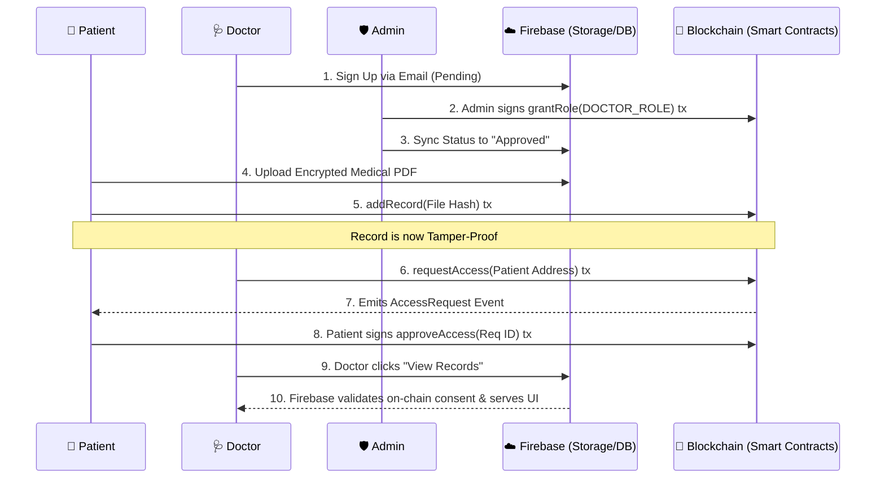

<div align="center">
  
  
  # HealthChain.AI 🧬
  
  **Next-Generation Hybrid Healthcare Platform**
  
  <p align="center">
    
    
    
    
    
  </p>

  *A luxurious, ultra-secure, role-based medical records system blending Web2 speed with Web3 immutability.*
</div>

<br/>

## ✨ The Vision
HealthChain.AI reimagines the healthcare experience. We combine a sleek, luxury-tier User Interface with a **Hybrid Blockchain Architecture**. Medical files and heavy queries are handled instantly via **Firebase**, while identity, access permissions, and document hashes are anchored immutably to the **Ethereum Blockchain**.

---

## 🛠️ The Tech Stack (What We Use & Why)

Building a healthcare application requires a delicate balance between **speed**, **usability**, and **absolute security (HIPAA/DISHA compliance)**. To achieve this, HealthChain.AI utilizes a true hybrid stack:

### 1. Off-Chain Layer (Firebase)
- **Firebase Auth:** Handles traditional email/password logins to provide a seamless Web2 user experience.
- **Firestore Database:** Stores non-sensitive metadata (like user names, roles, UI state) and handles lightning-fast queries for the dashboard.
- **Firebase Storage:** Securely vaults the actual heavy PDF medical documents (which are too large to store on a blockchain).

### 2. On-Chain Layer (Ethereum / Solidity)
- **Smart Contracts (Solidity):** The undeniable source of truth. We wrote custom smart contracts to handle Identity, Record Verification, and Permission Logic.
- **Hardhat:** Our local Ethereum development environment. It runs a private blockchain on your machine (port `8545`) allowing us to deploy and test smart contracts instantly without paying real gas fees.
- **Ethers.js:** The JavaScript library we use in the React frontend to communicate with the Hardhat blockchain.

### 3. Frontend Layer (React + Vite + Tailwind)
- We use **React 18** and **Vite** for a blazing fast frontend experience.
- The UI is styled with **Tailwind CSS**, focusing on a luxury aesthetic: glassmorphism panels, subtle micro-animations (`framer-motion`), and clean, modern typography.

---

## 🔗 How the Blockchain Works in HealthChain.AI

Instead of forcing users to install browser extensions like MetaMask, HealthChain.AI uses a revolutionary **"Invisible Web3"** approach.

### The "Burner Wallet" System
When you log in with your email, the application uses a cryptographic hash of your email address to deterministically generate a unique, secure Ethereum private key entirely in the background. 
1. This creates a hidden **"Burner Wallet"**.
2. The app automatically checks your wallet's balance on the local Hardhat network.
3. If it's empty, it automatically transfers **10 fake ETH** from a developer funding pool to your wallet.
4. Your wallet is now secretly connected to the app, allowing you to sign blockchain transactions invisibly just by clicking normal buttons!

### The Smart Contracts

```mermaid
graph TD
    classDef contract fill:#1e293b,stroke:#84cc16,stroke-width:2px,color:#fff,rx:10px,ry:10px;
    
    A[HealthChainRoles.sol<br/>(Identity & Roles)]:::contract
    B[HealthRecord.sol<br/>(Data Verification)]:::contract
    C[AccessRequest.sol<br/>(Consent Logic)]:::contract
    
    A --> |Provides Role Modifiers| B
    A --> |Validates Patient/Doctor/Admin| C
    C --> |Unlocks Access to| B
```

1. **`HealthChainRoles.sol` (Identity Management):** 
   - This contract registers Decentralized Identifiers (DIDs). 
   - It strictly enforces 3 roles: `PATIENT_ROLE`, `DOCTOR_ROLE`, and `ADMIN_ROLE`.
   - A Doctor cannot just "sign up". An Admin must explicitly call the `grantRole` function on the blockchain to verify their medical credentials.

2. **`HealthRecord.sol` (Immutable Integrity):** 
   - When a patient uploads a document to Firebase, the frontend calculates a `keccak256` cryptographic hash of the file.
   - This hash, along with a timestamp, is pushed to this contract. If a hacker alters the file in Firebase, the hash won't match the blockchain, proving the document was tampered with!

3. **`AccessRequest.sol` (Cryptographic Consent):** 
   - Doctors use this to send on-chain requests to view a patient's records.
   - Patients use this to explicitly sign a transaction granting consent. Without this on-chain approval event, the UI will not decrypt or serve the files to the Doctor.

---

## 🏛️ Step-by-Step Data Flow

Here is exactly what happens under the hood when a Doctor tries to view a Patient's records:



---

## 🚀 Quick Start (Local Development)

### Prerequisites
- Node.js (v18+)
- Hardhat (for local blockchain node)

### 1. Start the Blockchain
Open a terminal and spin up the local Ethereum network:
```bash
npx hardhat node
```

### 2. Deploy Contracts
In a second terminal, deploy the smart contracts to your local node:
```bash
npx ts-node --esm blockchain/scripts/deploy.ts
```

### 3. Start the UI
In a third terminal, start the Vite development server:
```bash
npm run dev
```

### 4. Test the Flow
1. Open `http://localhost:3000`
2. **Patient:** Sign up as a Patient. The app will invisibly generate your Ethereum wallet and fund it. Upload a file.
3. **Doctor:** Sign up as a Doctor. (You will be placed in a secure "Pending" state).
4. **Admin:** Log out, and log in with the default admin account (`admin@healthchain.ai` / password: `admin`). Approve the Doctor.
5. **Connect:** Log back in as the Doctor, request access to the Patient.
6. **Approve:** Log back in as the Patient, approve the request. The Doctor can now view your files!

---

## 🛡️ Offline Fallback & Resilience
HealthChain.AI is built to withstand network interruptions. If your local network, VPN, or ad-blocker blocks the Firebase connection (`firebaseio.com`), the application will automatically catch the offline error and construct a **Secure Local Offline Session** so you can still log in and access the dashboard without the app crashing.

<div align="center">
  <i>Built with ❤️ by Antigravity for the Future of Healthcare.</i>
</div>
